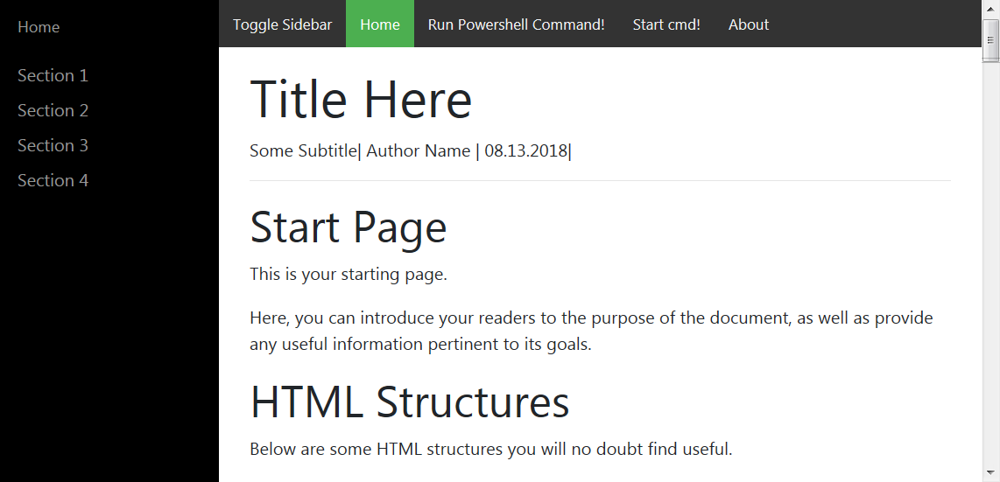

Interactive HTA Documents - Powershell et, al
===================

# Why?

I needed a means of producing documents on the Windows platform that could better engage the reader and perform some advanced actions such as interacting with the system.

I used the boilerplate from this repo [BlackrockDigital/startbootstrap-simple-sidebar](https://github.com/BlackrockDigital/startbootstrap-simple-sidebar) to create the basis for the interactive document.

The layout is clean, and I managed to tweak it to my liking: check it out:



# Implementation

Here's how I accomplished my goal:

- markdown for easy content creation, see [default.markdown](_template/default.markdown)
- javascript ActiveX Objects for interaction with the Windows OS
	- Powershell code can be embedded directly in your markdown and/or templates
	- The same goes for cmd commands (although not as elegantly)
- pandoc for content rendering, and for creating the single, self-contained output 
- Markdown pre-processing with `pp`
- cmder making the Windows commandline so much sweeter

# Requirements

In order for all of this to work, you'll need:

- **python 2.7+**
- [pandoc](https://pandoc.org/installing.html)
- [pp](https://github.com/CDSoft/pp) (Precompiled binaries available for Windows and Linux)
- [cmder][http://cmder.net/](optional, full version is best as it ships with git-bash)

# Features

The `build.sh` pandoc/pp wrapper script outputs a single .hta file as per specification.

I plan on extending functionality to allow for wider integration of programming languages.

# How to use

The wrapper script `build.sh` should help get you started with using this project.

**usage**:

```bash
Usage: ./build.sh
param: --vars|-V, help: [some_pandoc_var=somevalue]
param: --help|-h, help: display usage and exit
param: --ppvars|-p, help: [some_preprocess_var=somevalue]
param: --dry, help: Dry Run
param: --template|-t, help: [some/template/file.html]
param: --watchdir|-d, help: [somedir]
param: --interval|-i, help: [t>0]
param: --metavars|-m, help: [some_pandoc_meta_var=somevalue]
param: --output|-o, help: [some/output/file.html]
param: --source|-s, help: [some/markdown/file.md,some/other/markdown/file2.md,includes/*]
param: --watch|-w, help: [somefile1.md,somefile2.html,*.txt,*.md,*.js,*.etc]

```

## Example1: Build an HTA application from a markdown file

- Invoke the build script
	- `./build.sh -s _template/default.markdown -o default.hta -t _template/templates/default.html`
- Invoke the same, but as a dry run:
	- `./build.sh -s _template/default.markdown -o default.hta -t _template/templates/default.html --dry`
		- The above `--dry` run will print out:<br />
		`pp _template/default.markdown | pandoc -o 'default.hta' -c '_common/templates/default.css' -H '_common/templates/header.html' --template _template/templates/default.html --self-contained
--standalone`
- Again, only this time monitoring for file changes, triggering a rebuild if any files are modified within (t) seconds (where t is 1 by default)
	- `./build.sh -s _template/default.markdown -o default.hta -t _template/templates/default.html -w *.md,*.js,*.c ss,*.html`

## Example2: Add powershell to your document

- Add some powershell to the [default.markdown](_template/default.markdown):
```powershell
<a href="#" id="testing" class="powershell">CLICKME: POWERSHELL
<!--         
'You executed powershell!'
&pause
-->
</a> 
```

- Once the HTA file is rebuilt, you can refresh the HTA application by pressing F5. Your changes should have been rendered.

## Example3: Invoke a cmd shell from your document

- Add a link with class 'shell' to the [default.markdown](_template/default.markdown):
```cmd
<a href="#" class="shell" data-shell="cmd">Start cmd!</a>
```

- Once the HTA file is rebuilt, you can refresh the HTA application by pressing F5. Your changes should have been rendered.

# Appendix

## Under the hood

### Powershell Invocation

The powershell invocation is done through a WScript.Shell ActiveX Object and clever Windows clipboard manipulation,

so there is no need for intermediary scripts to handle the powershell code.

```javascript
/**
* Silently execute a powershell command. 
*/
function powershell(command_string, hidden, pause){
    start = 'start \"\"'
    if (pause == 1){
        pause = '&pause'
    } else {
        pause = ''
    }
    if (hidden == 1){
        hidden = '-w hidden -nologo -nop'
        start = ''
    } else {
        hidden = ''
    }    
    var clipboardData_orig = window.clipboardData.getData("Text");
    window.clipboardData.setData("Text",command_string); 
    var clipboardData = window.clipboardData.getData("Text");
    console.log("Powershell command is: " + clipboardData)
    command = String.format("%comspec% /c {0} PowerShell -noprofile {1} -Command $commands=$(\"Set-ExecutionPolicy Bypass -Scope Process -Force;add-type -AssemblyName System.Windows.Forms;[String]::Join( ';', $(  ( [System.Windows.Forms.Clipboard]::GetText() -split '\\r\\n' ) ))\");Invoke-Expression $commands;{2}", start, hidden, pause)
    console.log("Invoked Powershell command via: " + command)
    WshShell.run(command,0,true);
    setTimeout(function(t){
    window.clipboardData.setData("Text",clipboardData_orig); 
    }, 2000);
    return               
}
```

The WshShell ActiveX Object is instantiated in [default.html](_template/templates/default.html).

This is the jquery for handling hyperlinks with class 'powershell'

```javascript
/**
* For all html links (a) with class 'powershell' invoke the powershell command encased in comment strings <!--POWERSHELLCODE-->
*/
$( "a.powershell" ).click(function() {
var command_string = ''
var test = this.innerHTML.match(/<!--[\s\S]*-->/)
if (test != null){
    var regex = /<!--|-->/gi;
    command_string = test[0].replace(regex,'')
}else {
    command_string = heredoc(function () {/*
    'You must specify powershell commands for this link by encasing these in comment strings'
        'e.g.'
        '<a href="#" class="powershell">'
        '<!--'
            'Hello World!'
        '-->'
        '</a>'
        &pause
    */}); 
    alert(command_string)   
    return
}
var pause=this.getAttribute('data-pause')
if (pause != 1){
    pause = 0
}
var hidden=this.getAttribute('data-hidden')
if (hidden != 1){
    hidden = 0
}
powershell(command_string, hidden, pause);
});
```

Note the use of custom 'data-*' html attributes, keeping in compliance at least with HTML5.

## Sources

- [BlackrockDigital/startbootstrap-simple-sidebar](https://github.com/BlackrockDigital/startbootstrap-simple-sidebar): An off canvas sidebar navigation Bootstrap HTML template created by Start Bootstrap
- [jeremyben/HTAConsole](https://github.com/jeremyben/HTAConsole): HTA Console is a basic but practical Javascript Console Log to help debugging HTML Applications.
- [stack overflow - Get String in YYYYMMDD format from JS date object?](https://stackoverflow.com/questions/3066586/get-string-in-yyyymmdd-format-from-js-date-object)
- [stack overflow - Javascript heredoc - Stack Overflow](https://stackoverflow.com/questions/4376431/javascript-heredoc)
- [stack overflow - jquery - JavaScript sleep/wait before continuing - Stack Overflow](https://stackoverflow.com/questions/16873323/javascript-sleep-wait-before-continuing)
- [All You Need to Know About the HTML5 Data Attribute](https://webdesign.tutsplus.com/tutorials/all-you-need-to-know-about-the-html5-data-attribute--webdesign-9642)
- [ stack overflow - JavaScript equivalent to printf/String.Format - Stack Overflow](https://stackoverflow.com/questions/610406/javascript-equivalent-to-printf-string-format)